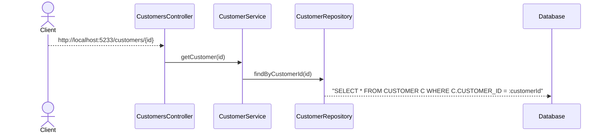

# clean-architecture

> [!NOTE]
> Hensikten med denne øvelsen er å se en arkitekturimplementasjon i praksis.
> Oppbygging av moduler er relativt typisk for denne typen arkitektur.
> Oppgavene gir deg innsikt i hvordan det er bygget opp.

Repo for clean architecture workshop.
Implementasjonen er inspirert av Clean Architecture fra https://blog.cleancoder.com/uncle-bob/2012/08/13/the-clean-architecture.html
Basert på clean architecture workshopen laget av Henrik Wingerei og Espen Ekvang(https://github.com/henriwi/clean-architecture).

Strukturen i repoet i "src"-mappen er som følger:

1. **domain**  
   Entiteter, valuetypes, aggregater
2. **application**  
   Applikasjonslogikk, query og command handlere
3. **infrastructure**  
   Database, eksterne tjenester, repsitorier
4. **web**  
   Controllere, dependency injection setup ++

**Domain** er den innerste delen av arkitekturen og skal derfor ikke referere til noe annet lag.
**Application** kan bare referere til **Domain**.  
**Infrastructure** kan referere til **Application** og **Domain**.  
**Web** er ytterst og kan dermed kjenne til alle lag.
Client


# Forutsetninger

- Maven
- JDK 17
- Editor (IntelliJ eller en annen valgfri editor)

# Kompilere og starte applikasjonen

For å kompilere: `mvn clean package`

## Kjøre applikasjonen

### Fra IntelliJ

- Åpne [`CleanArchitectureWorkshopApplication`](./web/src/main/kotlin/no/bekk/power/CleanArchitectureWorkshopApplication.kt) i web-modulen og kjør main metoden

### Fra terminalen

- Åpne en valgfri terminal hvor Maven er tilgjengelig
- Naviger til `web` og skriv `mvn spring-boot:run` etterfulgt av enter:

```
~\clean-architecture\web> mvn spring-boot:run
```

Applikasjonen skal være tilgjengelig på `http://localhost:5233` (definert i [`application.yml`](./web/src/main/resources/application.yml)).

# Database console

Hvis du ønsker å se på innholdet i databasen er den tilgjengelig gjennom følgende web console

- http://localhost:5233/h2-console
- JDBC URL: `jdbc:h2:file:./clean-architecture-h2-db`
- Brukernavn: `sa`
- Passord. `password`

# Tilgjengelige samlinger for requests

Det er opprettet flere samlinger med HTTP requests for å gjennomføre workshopen.
Den letteste veien til mål er ved hjelp av Intellij, som støtter både fila med rene HTTP requests, samt OpenAPI fila.
Alternativt har vi også en Postman-samling, og curl-kommandoer.

## HTTP Requests/Curl

Kallene i [`clean-architecture-intellij-requests.http`](./clean-architecture-intellij-requests.http) kan kjøres direkte fra Intellij.
Etter at du har åpnet http-fila, husk å velg miljø i vinduet rett over filinnholdet, slik at variablene er ferdigutfylte.

I kommentar over hvert kall ligger tilsvarende curl-kall, om du ønsker å kjøre kallene via kommandolinja.
CURL-kallene trenger bare at miljøvariabler er definert, for eksempel slik: 

`$ CUSTOMER_ID=1 curl --request GET "http://localhost:5233/customers/$CUSTOMER_ID"`

eller definere variabelen for flere kommandoer i samme shell:

```
$ export CUSTOMER_ID=1
$ curl --request GET "http://localhost:5233/customers/$CUSTOMER_ID"
```


## OpenAPI

I fila `clean-architecture-openapi.yaml` finner du en OpenApi-spec basert på Postman-fila.
Denne kan du importere i en støttet klient, og utføre kallene der.
Intellij skal være bundlet med en OpenApi plugin, slik at du kan kjøre kallene enkelt ved hjelp av `Try it out` knappen.

Insomnia er et annet eksempel på et verktøy for API-testing.

## Postman collection

`clean-architecture-postman-collection.json` er en postman collection med ressurser som representerer de ulike use casene i workshopen.

Postman-samlingen benytter variabler i postman i enkelte av ressursene. Dersom man vil sette verdi på disse variablene så kan man gjøre det ved å:
- klikk på "Environments" i Postman
- i Environment-oversikten klikk på "Globals"
- legg til ny variabel, f.eks `customerId` sett initial value til f.feks 42
- trykk "Save"
  Når man nå velger å benytte en ressurs i samlingen som krever `customerId` vil den automatisk hentes fra Globals i Postman.

# Use caser for workshopen

1. (En kunde skal kunne opprettes fra et navn, legal id, legal country.)
2. (En kunde skal kunne hentes vha id)
3. Alle kunder skal kunne hentes ut
4. En kunde skal kunne få lagt til målepunkter (id, navn, addresse, strømsone).
5. En kunde skal kunne si opp et målepunkt og beholde eventuelle andre målepunkter.
6. En kunde skal kunne se detaljer om alle målepunktene sine (strømsone, anleggsaddresse, et egendefinert navn f.eks. «hytta», status, type).
7. En kunde skal kunne se hva forbruket har vært på et gitt målepunkt i et gitt tidsrom.

# Slides

Slides fra workshopen er tilgjengelig i mappen `slides`

